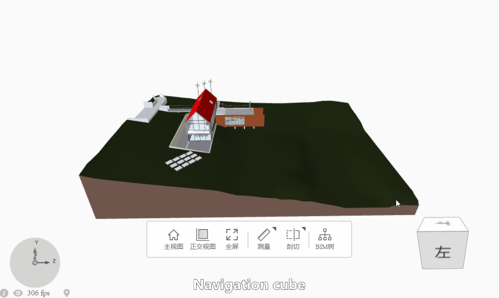

# gemini-viewer
WebGL BIM Viewer based on xeoKit-sdk, written with TypeScript.

## Installation
To install from npm:
```
npm install @pattern-x/gemini-viewer
```
## Documentation
The documents are under the `./docs`.
To generate the documents:
```
npm run docs
```

## Features
- Orthographic camera


- Distance measurement


- Section plane


- Section box


- Navigation cube


- Pivot


- Context menu


## Examples
To run the demo:
```
npm run demo
```
And then, visit [demo](localhost:3000/index.html).

Basic usages for Bimviewer is as followed. For more details, you could refference to [gemini-viewer-ui](https://github.com/pattern-x/gemini-viewer-ui) which is a react project build up with gemini-viewer.

```
import { BimViewer, KeyBoardRotatePlugin } from "@pattern-x/gemini-viewer";

const project = {
    id: "technical_school_normal",
    name: "technical_school_normal",
    thumbnail: "/projects/technical_school_normal/thumbnail.png",
    camera: {
        eye: [-65, 37, 41],
        look: [-15, 0, 15],
        up: [0, 1, 0],
        far: 10000,
    },
    models: [
        {
            name: "technical school normal",
            src: "/projects/technical_school_normal/Technical_school-current_m.gltf",
            position: [0, 0, 0],
            rotation: [0, 0, 0],
            scale: [1, 1, 1],
            edges: true,
            visible: true,
        },
    ],
};

const bimViewer = new BimViewer(
    {
        canvasId: "myCanvas",
        // use default css if navCubeCanvasId or axisGizmoCanvasId not given
        // navCubeCanvasId: "myNavCubeCanvas",
        // axisGizmoCanvasId: "myAxisGizmoCanvas",
        swapYZ: true,
        activeOrthoMode: true,
        // locale: "en"
        skyBoxImgSrc: "images/skybox/default.png"
    },
    project.camera
);

new KeyBoardRotatePlugin(bimViewer.viewer);

// loadProjectModel
let counter = 0; // to indicate how many models are loading
project.models.forEach((modelCfg) => {
    if (modelCfg.visible === false) {
        // visible is true by default
        return; // only load visible ones
    }
    counter++;
    bimViewer.loadModel(modelCfg, (model) => {
        counter--;
        if (counter === 0) {
            if (bimViewer.has2dModel && !bimViewer.has3dModel) {
                bimViewer.active2dMode();
            }
        }
        // Do something with model
        // console.log("model:", model);

        // Gets the image data of the model canvas.
        // console.log(bimViewer.getCanvasImageDataUrl());
    });
});
...
```
## BimViewer Configuration Summary
| Name                  | Type             | Attribute                             | Description                                                                                                                          |
| --------------------- | ---------------- | ------------------------------------- | ------------------------------------------------------------------------------------------------------------------------------------ |
| canvasId              | string           |                                       | For `Xeokit Viewer`.                                                                                                                 |
| enableNavCube         | boolean          | - optional <br> - default: `true`     | Shows the NavCube.                                                                                                                   |
| enableAxisGizmo       | boolean          | - optional <br> - default: `true`     | Shows the AxisGizmo.                                                                                                                 |
| enableToolbar         | boolean          | - optional <br> - default: `true`     | Shows the toolbar.                                                                                                                   |
| enableBottomBar       | boolean          | - optional <br> - default: `true`     | shows the bottom-bar.                                                                                                                |
| enableContextMenu     | boolean          | - optional <br> - default: `true`     | Shows the context-menu.                                                                                                              |
| enableFastNav         | boolean          | - optional <br> - default: `true`     | Enables FastNav  <br> Viewer plugin that improves interactivity by disabling expensive rendering effects while the Camera is moving. |
| enableSingleSelection | boolean          | - optional <br> - default: `true`     | Enable single selection.                                                                                                             |
| spinnerElementId      | string           | - optional                            | The id of customized spinner element. <br> For `Xeokit Viewer.scene`.                                                                |
| swapYZ                | boolean          | - optional <br> - default: `false`    | Swaps Y / Z axis.                                                                                                                    |
| navCubeCanvasId       | string           | - optional                            | The id of the customized canvas to draw NavCube. <br> It will use the default NavCube when this param is empty.                      |
| axisGizmoCanvasId     | string           | - optional                            | The id of the customized canvas to draw AxisGizmo. <br> It will use the default AxisGizmo when this param is empty.                  |
| antialias             | boolean          | - optional                            | For `Xeokit Viewer.scene`.                                                                                                           |
| transparent           | boolean          | - optional                            | For `Xeokit Viewer.scene`.                                                                                                           |
| gammaInput            | boolean          | - optional                            | For `Xeokit Viewer.scene`.                                                                                                           |
| gammaOutput           | boolean          | - optional                            | For `Xeokit Viewer.scene`.                                                                                                           |
| backgroundColor       | number[]         | - optional                            | For `Xeokit Viewer.scene.canvas`.                                                                                                    |
| units                 | string           | - optional <br> - default: `"meters"` | For `Xeokit Viewer.scene.metrics`. <br>                                                                                              |
| scale                 | number           | - optional                            | For `Xeokit Viewer.scene.metrics`.                                                                                                   |
| origin                | number[]         | - optional                            | For `Xeokit Viewer.scene.metrics`.                                                                                                   |
| saoEnabled            | boolean          | - optional                            | For `Xeokit Viewer.scene.sao`.                                                                                                       |
| pbrEnabled            | boolean          | - optional                            | For `Xeokit Viewer.scene`.                                                                                                           |
| activeOrthoMode       | boolean          | - optional                            | Enter ortho mode by default.                                                                                                         |
| locale                | "cn" &#124; "en" | - optional <br> - default: `"cn"`     | Sets the default locale.                                                                                                             |
| skyBoxImgSrc          | string           | - optional                            | The image src of the skybox.<br> It will use default background color when this param is empty.                                      |
